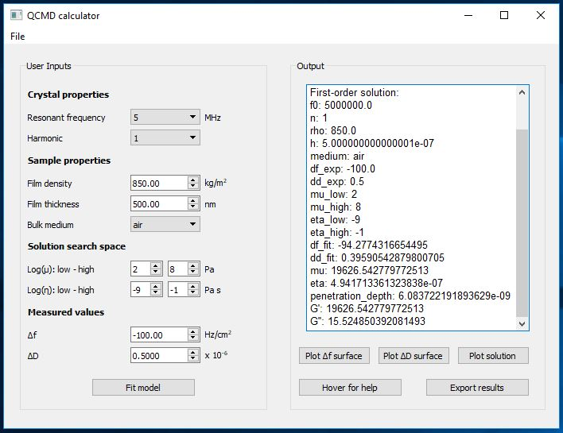
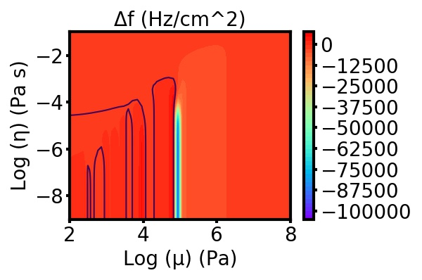
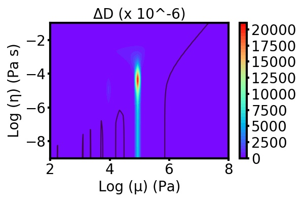
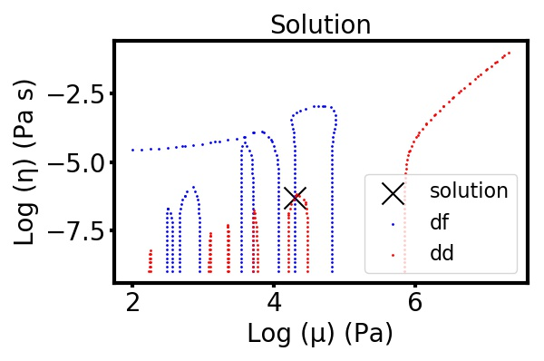

# QCMD_calculator

This is GUI-based software which enables calculation of
viscoelastic properties from quartz crystal microbalance (QCM-D) data by
fitting ΔF and ΔD QCM data to the
Kelvin-Voigt model to obtain viscosity and shear modulus of
an adlayer film, enabling estimation of G' and G'' (elastic and loss moduli).

Use the *User Inputs* section to input experimental data. Run the
viscoelastic model. Once the solution is found, you may adjust
the range of μ and η values to limit the search space and obtain
a solution with higher precision.  

For more information about the viscoelastic model, see:
1.   Voinova, M.V., Rodahl, M., Jonson, M. and Kasemo, B., 1999. Viscoelastic
acoustic response of layered polymer films at fluid-solid interfaces:
continuum mechanics approach. Physica Scripta, 59(5), p.391.
https://iopscience.iop.org/article/10.1238/Physica.Regular.059a00391/meta
2.   Liu, S.X. and Kim, J.T., 2009. Application of Kelvin—Voigt model in
quantifying whey protein adsorption on polyethersulfone using QCM-D.
JALA: Journal of the Association for Laboratory Automation, 14(4),
pp.213-220.
https://journals.sagepub.com/doi/full/10.1016/j.jala.2009.01.003

Created on Dec 9 2019
@author: ericmuckley@gmail.com
